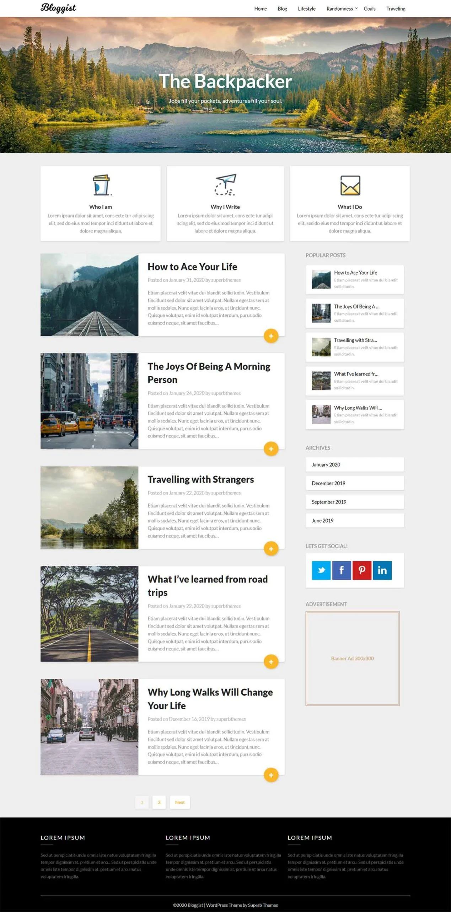

<h1 align="center">Blog Template</h1>

Responsive Blog Template using HTML, CSS ( Flexbox ), JavaScript

<h2></h2>

<a href="https://mre-dev.github.io/Blog-Template/">----- Click To View Demo -----</a>

<h2></h2>

  
Screenshot : 

  

